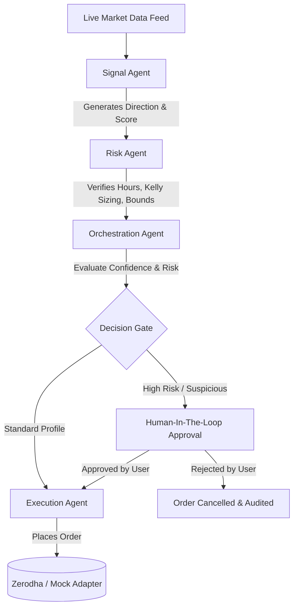

# FutureEdge — Multi-Agent AI Autonomous Trading System

FutureEdge is a state-of-the-art, fully autonomous algorithmic trading system designed for the Indian Equity Markets (NSE/BSE). Powered by a collaborative team of specialized AI agents built on **LangGraph**, it enables real-time market regime detection, multi-indicator technical voting, tail-risk management, human-in-the-loop validation, and instant trade execution via **Zerodha Kite Connect**.

---

## 🌟 Key Features

* **Multi-Agent Decision-Making**: Utilizes 7 distinct LangGraph agents collaborating in a structured workflow to generate, double-check, and execute trades.
* **Human-in-the-Loop (HITL) Gate**: High-risk or large-size trades are automatically paused, sending a push alert to the dashboard for human verification before order entry.
* **Dual Broker Execution Mode**: Fully supports simulated paper-trading (**Test Mock** portfolio) and real-time execution (**Zerodha Kite Connect**) with zero code modifications.
* **Real-time Live Dashboard**: Sleek, high-performance UI showing streaming charts, real-time agent vote tallies, unified portfolio P&L metrics, and an instant global Kill Switch.
* **Market Hours Guard**: Automatically halts live trading when the Indian National Stock Exchange (NSE) is closed (9:15 AM to 3:30 PM IST).
* **AI Rationale & Memory**: Employs Large Language Models (LLMs) to explain trades in plain English and indexes past performance in Qdrant vector memory to improve future execution.

---

## 🛠️ The Technology Stack

| Layer | Technologies |
| :--- | :--- |
| **Frontend** | Next.js 14, React, Tailwind CSS, Zustand, SWR, Lucide, WebSockets |
| **Backend** | FastAPI, Python 3.12, Uvicorn, LangGraph, LangChain, Pydantic |
| **Databases** | PostgreSQL (Trade ledger), Redis (State cache & WebSockets), Qdrant (Episodic Memory) |
| **Data Feed** | Zerodha Kite API, Yahoo Finance (yfinance) |

---

## 🤖 The AI Agent Team

The core system logic is divided among specialized sub-agents that operate on a shared `AgentState` graph:



### Agent Roles & Functions

1. **Signal Agent**: Scans technical indicators (MACD, RSI, Bollinger Bands), order book spreads, and volume spikes on active tickers to generate a raw BUY/SELL/HOLD vote.
2. **Risk Agent**: Enforces hard safety limits, calculates optimal position size using the Kelly Criterion, and checks late-day volatility limits.
3. **Orchestration Agent**: Coordinates the LangGraph execution flow, aggregates sub-agent telemetry, and determines whether the trade requires HITL review.
4. **Execution Agent**: Translates trades into broker orders, maps index tickers (e.g., `"NIFTY 50"` to tradeable ETFs like `"NIFTYBEES"`), and handles raw API execution.
5. **Portfolio Agent**: Monitors current cash balances, open margin levels, and active positions to determine allocation limits.
6. **Regime Detector**: Runs statistical analysis on market history to classify the environment (Trending Up, Trending Down, Sideways) and shifts indicator weightings accordingly.
7. **LLM Reasoner**: Employs LLM analysis to evaluate market context and generate plain-English rationales for trades.

---

## 📂 Project Structure

```
futureedge/                          ← project root
├── docker-compose.yml               ← runs database containers and app servers
│
├── backend/                         ← FastAPI web framework & agent runtimes
│   ├── Dockerfile
│   ├── requirements.txt
│   └── app/
│       ├── main.py                  ← Server entry point & routes registration
│       ├── agents/                  ← AI sub-agents logic (Signal, Risk, Execution, etc.)
│       ├── api/routes/              ← API Endpoints (Workflow, Broker, Auth, Kill Switch)
│       ├── brokers/                 ← Adapters for Zerodha Kite and simulated paper-trading
│       ├── core/config.py           ← Config parsing for environment variables
│       ├── data/                    ← Market feeds, technical indicators, and data streams
│       ├── db/                      ← Database schema models (PostgreSQL, Redis)
│       └── graph/                   ← LangGraph compiler, state definitions, and runtime
│
└── frontend/                        ← Next.js 14 dashboard UI
    ├── Dockerfile
    ├── package.json
    └── src/
        ├── app/                     ← App router routes (Dashboard, Login, Backtest)
        ├── components/              ← Reusable UI panels, charts, and modal components
        ├── store/index.ts           ← Zustand store for global auth, websockets, & metrics
        └── types/index.ts           ← Unified TypeScript interfaces matching backend
```

---

## 🚀 Getting Started

Follow these steps to set up and run the system locally using Docker.

### 1. Configure Secrets
Create a `.env` file in the root directory:
```bash
cp env.example .env
```

At a minimum, configure the following variables in `.env`:
```bash
POSTGRES_PASSWORD=your_strong_password
JWT_SECRET_KEY=generate_your_own_secure_key
```

### 2. Launch Databases
Start PostgreSQL, Redis, and Qdrant in the background:
```bash
docker compose up -d db redis qdrant
```

### 3. Initialize Databases
Initialize database schemas and compile table structures:
```bash
docker compose run --rm backend python -m app.scripts.create_tables
```

### 4. Create Admin Account
Create a default admin user to access the web panel:
```bash
docker compose run --rm backend python -m app.scripts.create_admin
```
*Follow the interactive terminal prompts to set your Name, Email, and Password.*

### 5. Launch the Application
Start the frontend and backend servers:
```bash
docker compose up
```
* The **Frontend Dashboard** will be available at: **http://localhost:3000**
* The **Backend Interactive API Docs** will be available at: **http://localhost:8000/docs**

---

## 🔌 Switching to Live Trading (Zerodha)

By default, the system operates in **Test Mock** mode, utilizing simulated funds. To connect the system to your active broker account:

1. Create a developer account at [Kite Trade](https://kite.trade) and create an app.
2. Retrieve your **API Key** and **API Secret** and update your `.env` file:
   ```env
   ZERODHA_API_KEY=your_key_here
   ZERODHA_API_SECRET=your_secret_here
   ```
3. Generate your daily session token (required by Zerodha at the start of each trading day):
   ```bash
   docker compose run --rm backend python -m app.scripts.generate_zerodha_token
   ```
4. Set the broker and data feed values to Zerodha in your `.env` file:
   ```env
   ACTIVE_BROKER=zerodha
   ACTIVE_FEED=zerodha
   ```
5. Restart your backend service:
   ```bash
   docker compose restart backend
   ```

*Note: Zerodha session tokens expire at 6:00 AM IST daily. Make sure to run the `generate_zerodha_token` script before market open.*

---

## 🛡️ Role Permissions Matrix

The dashboard enforces role-based access control based on the active session role:

| Action | Viewer | Trader | Risk Manager | Admin |
| :--- | :---: | :---: | :---: | :---: |
| **View Charts & P&L** | ✓ | ✓ | ✓ | ✓ |
| **View Trade Ledgers** | ✓ | ✓ | ✓ | ✓ |
| **Trigger Agent Runs** | ✗ | ✓ | ✓ | ✓ |
| **HITL Approvals/Rejections** | ✗ | ✗ | ✓ | ✓ |
| **Trigger Global Kill Switch** | ✗ | ✗ | ✓ | ✓ |
| **Manage Users & Roles** | ✗ | ✗ | ✗ | ✓ |

---

## 📊 System Architecture & Profitability Roadmap

Below is a summary of the technical optimizations and engineering milestones defined to maximize the system's yield and minimize market transaction drag:

1. **Precision Sizing**: Implements the Kelly Criterion based on closed-trade win/loss history rather than generic percentage weights.
2. **Dynamic Spreads & Slippage Guard**: Real-time tools assess order book depth. Sizing values are automatically reduced if target spreads exceed 0.5%.
3. **Regime-Conditioned Rules**: Oscillator inputs (RSI, Bollinger Bands) are ignored during strong trend phases, switching focus to MACD crossovers and trend-following metrics.
4. **Late-Day Tail Risk Veto**: The Risk Agent warns traders at 3:00 PM IST and issues an absolute block (VETO) after 3:15 PM IST to prevent carrying unintended overnight margins.