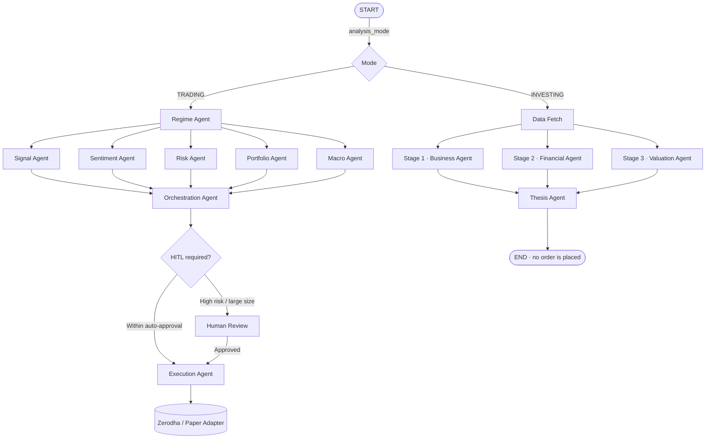

# FutureEdge — Multi-Agent AI System for Indian Equities

FutureEdge is a multi-agent system for the Indian equity markets (NSE/BSE), built on **LangGraph**. It runs in two distinct modes off a single graph:

* **Trading mode** — intraday. Regime detection, multi-indicator agent voting, risk sizing, human-in-the-loop approval, and live order execution via **Zerodha Kite Connect**.
* **Investing mode** — long-term. A three-stage fundamental analysis (qualitative checklist → financial due diligence → DCF) that produces a written thesis and a valuation band. **It is advisory only and places no orders**, ever — you act on it yourself at your broker.

The two modes share state definitions and infrastructure but no execution path. Investing runs cannot reach the order-placement code, by construction.

---

## 🌟 Key Features

### Trading mode
* **Multi-agent decision-making** — five agents vote in parallel after regime detection; an orchestrator aggregates them into a single proposal.
* **Human-in-the-loop (HITL) gate** — high-risk or large-size trades pause and wait for an explicit human approval before any order is sent.
* **Dual broker execution** — simulated paper trading (`mock`) and live Zerodha, swapped by config with no code change.
* **Market hours guard** — the risk agent warns from 3:00 PM IST and hard-vetoes new entries after 3:15 PM IST, so nothing carries overnight unintentionally.
* **Global kill switch** — fails closed: once halted, it stays halted until a human explicitly releases it.
* **Real-time dashboard** — streaming charts, live agent vote tallies, portfolio P&L, and the kill switch.
* **AI rationale & memory** — LLM-written plain-English explanations, with past trades indexed in Qdrant for retrieval on future runs.

### Investing mode
* **Stage 1 — business checklist**: 18 qualitative questions answered from the company's own filings, using a RAG store built from annual reports, concall transcripts, and credit-rating reports — with **web search as a fallback** for what the filings leave empty. Every answer records which tier produced it, because an audited filing and a page a model found are not the same evidence.
* **Stage 2 — financial due diligence**: the 10-point checklist (margins, growth divergence, dilution, leverage, inventory/debtor days, CFO, ROE, segment sprawl, subsidiaries), each check carrying its own source.
* **Stage 3 — intrinsic value**: a full 10-step DCF — CAPM discount rate from a live beta, two-stage growth, Gordon *and* exit-multiple terminal values, net-debt adjustment, a ±10% band, a margin-of-safety price, a reverse DCF, and a sensitivity grid.
* **Nothing is silently dropped** — any figure a stage could not compute is recorded as a `MissingDatum` with a reason, and the thesis reports its own completeness. A scorecard missing four checks never looks like one that passed ten.
* **Stance is computed on read, never stored** — it depends on the live price and on whether you hold the position, so persisting it would make it stale the moment the market moved. Every stance records the exact rule that produced it.

---

## 🛠️ The Technology Stack

| Layer | Technologies |
| :--- | :--- |
| **Frontend** | Next.js 14, React, Tailwind CSS, Zustand, SWR, Lucide, WebSockets |
| **Backend** | FastAPI, Python 3.11, Uvicorn, LangGraph, LangChain, Pydantic |
| **Databases** | PostgreSQL (trade ledger, scorecards, holdings), Redis (state cache & WebSockets), Qdrant (episodic memory + company documents) |
| **Data** | Zerodha Kite API, Yahoo Finance (yfinance), Screener.in fundamentals, BSE-hosted annual report PDFs |
| **AI** | OpenAI — `gpt-4o-mini` for trade rationale and Stage 1 synthesis, `text-embedding-3-small` for document embeddings. An OpenAI-compatible local endpoint can be substituted via `LOCAL_MODEL_BASE_URL`. |

---

## 🤖 The Agent Graph

A conditional edge on `START` picks the branch by `analysis_mode`. Anything missing or unrecognised defaults to `TRADING`, so callers and checkpoints written before investing mode existed keep working unchanged.



### Trading agents

1. **Regime Detector** — classifies the environment (trending up/down, sideways, high-vol) and shifts indicator weights before any voting happens.
2. **Signal Agent** — technical indicators (RSI, MACD, Bollinger Bands, multi-timeframe) into a raw BUY/SELL/HOLD vote.
3. **Sentiment Agent** — news and sentiment scoring for the symbol.
4. **Risk Agent** — hard safety limits, Kelly-criterion sizing, market-hours and late-day vetoes.
5. **Portfolio Agent** — cash, margin, and open positions, to bound allocation.
6. **Macro Agent** — broader market and macro context.
7. **Orchestration Agent** — aggregates the five votes, writes the LLM rationale, and decides whether HITL review is required.
8. **Execution Agent** — translates an approved proposal into a broker order and maps index tickers to tradeable instruments (e.g. `"NIFTY 50"` → `"NIFTYBEES"`).

### Investing agents

1. **Data Fetch** — scrapes and caches fundamentals, then derives the numbers the three stages share. Deriving once is what lets Stages 2 and 3 run as siblings instead of a chain, even though a DCF appears to depend on the financial checklist.
2. **Business Agent (Stage 1)** — retrieves from the document store and answers the 18 questions, collecting red flags separately from routine answers.
3. **Financial Agent (Stage 2)** — the 10-point checklist, with explicit guards against the classic traps: growth off a near-zero base, EBITDA mistaken for free cash flow, one-off items distorting a CAGR.
4. **Valuation Agent (Stage 3)** — the DCF, returning a band and a sensitivity grid rather than a single false-precision number.
5. **Thesis Agent** — combines the three into a quality grade, a completeness figure, a conviction figure, and non-prescriptive prose. The verb (BUY/HOLD/WATCH) is deliberately not part of it.

---

## 📂 Project Structure

```
futureedge/                          ← project root
├── docker-compose.yml               ← database containers and app servers
├── CLAUDE.md                        ← project conventions and hard rules
├── docs/                            ← CONCEPTS, IMPLEMENTATION_PLAN, CHALLENGES, handbook
├── tests/                           ← pytest suite, mirroring backend/app/
│
├── backend/                         ← FastAPI app and agent runtimes
│   ├── Dockerfile
│   ├── requirements.txt
│   ├── .env.example                 ← template for the root .env
│   └── app/
│       ├── main.py                  ← entry point and router registration
│       ├── agents/                  ← trading + investing agents, one file each
│       ├── api/routes/              ← endpoints (workflow, broker, auth, kill switch, investing)
│       ├── brokers/                 ← Zerodha and paper adapters behind get_broker()
│       ├── core/config.py           ← pydantic-settings, reads .env
│       ├── data/                    ← feeds, indicators, fundamentals scraper, documents, beta
│       ├── db/                      ← SQLAlchemy models and repositories
│       ├── graph/                   ← LangGraph builder, shared state, runtime
│       ├── jobs/                    ← scheduled work (exit monitor, document ingestion, …)
│       ├── memory/                  ← Qdrant stores — episodic memory and company documents
│       ├── services/                ← kill switch, portfolio, stance, notifications
│       └── scripts/                 ← create_tables, create_admin, token generation
│
└── frontend/                        ← Next.js 14 dashboard
    ├── Dockerfile
    ├── package.json
    └── src/
        ├── app/                     ← App Router (login, dashboard, /trades, /backtest, /users)
        ├── components/              ← UI panels, charts, modals
        ├── hooks/                   ← shared React hooks
        ├── lib/                     ← API client and helpers
        ├── store/index.ts           ← Zustand store (auth, websockets, metrics)
        └── types/index.ts           ← TypeScript interfaces matching the backend
```

---

## 📚 Architecture & Concepts

* **[docs/CONCEPTS.md](docs/CONCEPTS.md)** — design choices, database schemas, and the math.
* **[docs/IMPLEMENTATION_PLAN.md](docs/IMPLEMENTATION_PLAN.md)** — the current task list and what is still outstanding.
* **[docs/CHALLENGES.md](docs/CHALLENGES.md)** — coding challenges and interview-style questions on these patterns.
* **[fundamental_analysis_steps.md](fundamental_analysis_steps.md)** — the three-stage method the investing mode implements.

---

## 🚀 Getting Started

### 1. Configure secrets

Create a `.env` in the **project root** (this is the file both the backend and Docker Compose read):

```bash
cp backend/.env.example .env
```

At a minimum:

```bash
POSTGRES_PASSWORD=your_strong_password
JWT_SECRET_KEY=generate_your_own_secure_key
```

`.env` and `broker_token.json` are gitignored. Keep them that way — never commit a real key, secret, or access token.

### 2. Launch the databases

```bash
docker compose up -d postgres redis qdrant
```

### 3. Initialize the schema

```bash
docker compose run --rm backend python -m app.scripts.create_tables
```

> Note: this runs `create_all()`, which creates missing tables but never alters existing ones. If a model's columns change, drop that table (or write a migration) — otherwise the change silently does not apply.

### 4. Create an admin account

```bash
docker compose run --rm backend python -m app.scripts.create_admin
```

*Follow the prompts to set name, email, and password.*

### 5. Start the application

```bash
docker compose up
```

* **Dashboard**: http://localhost:3000
* **Interactive API docs**: http://localhost:8000/docs

### Running the tests

```bash
PYTHONPATH=backend ./.venv/bin/pytest tests
ruff check backend/app --select E,F --ignore E501,E402
cd frontend && npm run build
```

---

## 📈 Using Investing Mode

Investing mode is advisory. It never touches the broker, and the execution agent refuses an investing-mode state before it reads anything else.

### 1. Add an OpenAI key

The same `OPENAI_API_KEY` that powers trade rationale also embeds and retrieves company documents for Stage 1:

```env
OPENAI_API_KEY=sk-...
```

Embeddings default to `text-embedding-3-small` (1536 dims), stored in the `company_documents` Qdrant collection. Costs are negligible at watchlist scale — the expense is one-time ingestion, not the queries.

### 2. Ingest a company's documents

Ingestion is deliberately **out-of-band and one-time**: it downloads annual reports, concall transcripts, and credit-rating reports, extracts text page by page, and embeds them. Analysis then only queries the store.

```bash
docker compose run --rm backend python -c "
import asyncio
from app.jobs.document_ingestion import ingest_symbol
print(asyncio.run(ingest_symbol('ITC')))
"
```

Or ingest the whole watchlist (`INVESTING_WATCHLIST_SYMBOLS` in `.env`) with `ingest_watchlist()`.

**Ingestion is not optional in practice.** A symbol with no documents scores about 1 of 18 on Stage 1 from filings alone. Web search now covers the gap, but it costs money per question and cites the open web rather than an audited report — ingest first, and let search fill what is genuinely not in the filings.

### 3. Run an analysis

```http
POST /api/v1/investing/{symbol}/analyze     # runs all three stages, persists the scorecard
GET  /api/v1/investing/{symbol}/thesis      # the stored thesis + a stance at the live price
GET  /api/v1/investing/watchlist
POST /api/v1/investing/manual-input         # supply a figure the system could not compute
GET  /api/v1/investing/{symbol}/manual-inputs
GET  /api/v1/investing/holdings             # your long-term register
POST /api/v1/investing/holdings
DELETE /api/v1/investing/holdings/{symbol}
```

The first run on a symbol is slow — it scrapes and retrieves. Fundamentals are then Redis-cached for three days.

### Why holdings matter

The stance depends on whether you own the thing. The same company, at the same price, with the same valuation band, is **HOLD** if you own it and **WATCH** if you don't — because a price below the band but above your margin-of-safety trigger is not a buy either way. Recording what you actually hold is what makes that distinction possible.

The matrix is asymmetric on purpose: a quality company that has run far past its band is never a SELL. Overvaluation is a reason to stop buying, not a reason to exit a good business.

### Tuning the valuation

DCF assumptions live in `.env` and are all visible in the output's `assumptions` block:

```env
RISK_FREE_RATE_PCT=6.5          # 10-year Indian government bond yield
EQUITY_RISK_PREMIUM_PCT=4.5
DCF_STAGE1_GROWTH_PCT=15.0      # years 1-5
DCF_STAGE2_GROWTH_PCT=10.0      # years 6-10
DCF_TERMINAL_GROWTH_PCT=3.5     # never at or above the discount rate
DCF_EXIT_MULTIPLE=20.0          # for the alternative terminal value
```

`RISK_FREE_RATE_PCT` is a hardcoded figure with a `RISK_FREE_RATE_REVIEWED` date beside it. Check it periodically — a stale bond yield quietly biases every intrinsic value the system produces.

---

## 🔌 Switching to Live Trading (Zerodha)

By default the system runs in **mock** mode with simulated funds. To connect a live broker account:

1. Create a developer account at [Kite Trade](https://kite.trade) and register an app.
2. Add your credentials to `.env`:
   ```env
   ZERODHA_API_KEY=your_key_here
   ZERODHA_API_SECRET=your_secret_here
   ```
3. Generate the daily session token:
   ```bash
   docker compose run --rm backend python -m app.scripts.generate_zerodha_token
   ```
4. Point the broker and feed at Zerodha:
   ```env
   ACTIVE_BROKER=zerodha
   ACTIVE_FEED=zerodha
   ```
5. Restart the backend:
   ```bash
   docker compose restart backend
   ```

*Zerodha session tokens expire at 6:00 AM IST daily — regenerate before market open.*

---

## 🛡️ Role Permissions Matrix

| Action | Viewer | Trader | Risk Manager | Admin |
| :--- | :---: | :---: | :---: | :---: |
| **View charts & P&L** | ✓ | ✓ | ✓ | ✓ |
| **View trade ledgers** | ✓ | ✓ | ✓ | ✓ |
| **View investing theses & holdings** | ✓ | ✓ | ✓ | ✓ |
| **Trigger agent runs** | ✗ | ✓ | ✓ | ✓ |
| **Run a fundamental analysis** | ✗ | ✓ | ✓ | ✓ |
| **Record holdings / manual inputs** | ✗ | ✓ | ✓ | ✓ |
| **HITL approvals/rejections** | ✗ | ✗ | ✓ | ✓ |
| **Trigger global kill switch** | ✗ | ✗ | ✓ | ✓ |
| **Manage users & roles** | ✗ | ✗ | ✗ | ✓ |

Investing writes sit at **Trader**, not Risk Manager: no money moves, so routing research data through the same approval gate as an order would dilute what that gate means.

---

## 📊 Design Notes

Decisions worth knowing before changing anything:

1. **Precision sizing** — Kelly criterion off actual closed-trade win/loss history, not a fixed percentage.
2. **Spread and slippage guard** — order book depth is checked live; size is cut automatically when the spread exceeds 0.5%.
3. **Regime-conditioned rules** — oscillators (RSI, Bollinger) are down-weighted in strong trends, where MACD and trend-following metrics take over.
4. **Late-day tail-risk veto** — warned at 3:00 PM IST, hard block after 3:15 PM IST.
5. **The kill switch fails closed** — a halt persists until a human explicitly releases it. There is no silent auto-expiry, and reintroducing one would be a regression.
6. **Investing mode never executes** — the execution agent rejects an investing-mode state before it reads the consensus or the kill switch. This is defence in depth: the graph already has no edge from the investing branch to execution.
7. **Missing data is visible, not hidden** — stages record what they could not compute and why, and the thesis reports its own completeness. Absence of a red flag means "nothing found", never "clean".

---

## ⚖️ Disclaimer

This is a personal research and engineering project, not financial advice. Investing mode deliberately stops at "here is what the business looks like and what it appears to be worth" — position sizing and the decision to act are yours, executed by you at your own broker. Trading mode can place real orders with real money; run it in `mock` until you have read the code and understand exactly what it will do.
