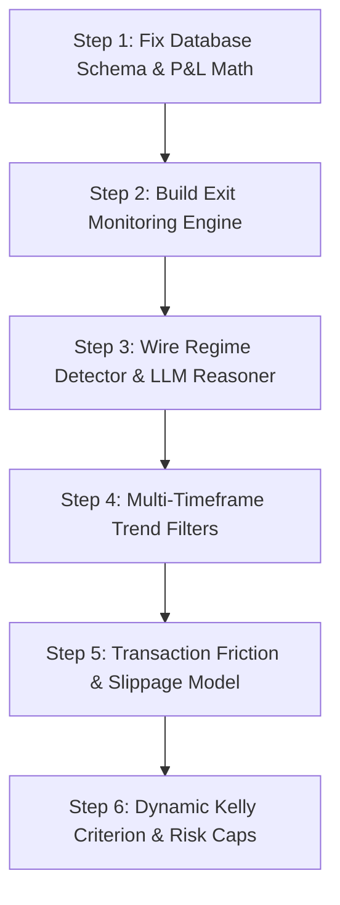

# FutureEdge — AI Trading System for Indian Equity Markets

Multi-agent AI trading system for NSE/BSE via Zerodha Kite Connect.

---

## Folder Structure

```
futureedge/                          ← project root
├── .env                             ← shared secrets (never commit)
├── .gitignore
├── docker-compose.yml               ← runs the full stack
│
├── backend/                         ← FastAPI application
│   ├── Dockerfile
│   ├── requirements.txt
│   └── app/
│       ├── main.py                  ← FastAPI entry point
│       ├── agents/                  ← 7 LangGraph agent nodes
│       ├── api/routes/              ← REST + WebSocket endpoints
│       ├── auth/                    ← JWT auth + dependencies
│       ├── brokers/                 ← Zerodha + mock adapters
│       ├── core/config.py           ← all settings from .env
│       ├── data/                    ← yfinance feed, indicators, regime
│       ├── db/                      ← PostgreSQL + Redis + models
│       ├── graph/                   ← LangGraph state + builder + runtime
│       ├── jobs/                    ← weight updater background job
│       ├── memory/                  ← Qdrant episodic memory
│       ├── models/                  ← FinBERT + LLM reasoner
│       └── scripts/                 ← create_tables, create_admin, test_*
│
└── frontend/                        ← Next.js 14 dashboard
    ├── Dockerfile
    ├── package.json
    ├── .env.local
    └── src/
        ├── app/                     ← Next.js App Router pages
        │   ├── layout.tsx           ← root layout (font, dark mode, toasts)
        │   ├── page.tsx             ← root redirect → /dashboard or /login
        │   ├── login/page.tsx       ← login form
        │   └── dashboard/
        │       ├── layout.tsx       ← sidebar + header + auth guard + WS
        │       ├── page.tsx         ← live chart + agent votes + PnL
        │       ├── trades/page.tsx  ← trade history table
        │       └── users/page.tsx   ← user management (admin only)
        ├── components/
        │   ├── charts/              ← PriceChart, PnLChart
        │   ├── dashboard/           ← AgentVoteCard, StatCard
        │   ├── trading/             ← KillSwitchButton, HITLModal
        │   └── ui/                  ← Toast notifications
        ├── hooks/                   ← useWebSocket, useKillSwitch
        ├── lib/api.ts               ← axios + auto token refresh
        ├── store/index.ts           ← Zustand (auth + live trading state)
        └── types/index.ts           ← TypeScript types matching backend
```

---

## First-time Setup (run once)

### 1. Create your .env file
```bash
cp env.example .env
```

Edit `.env` and set at minimum:
```bash
POSTGRES_PASSWORD=your_strong_password
JWT_SECRET_KEY=$(python3 -c "import secrets; print(secrets.token_hex(32))")
```

### 2. Start databases
```bash
docker compose up -d db redis qdrant
```

### 3. Create database tables
```bash
docker compose run --rm backend python -m app.scripts.create_tables
```

### 4. Create your admin user
```bash
docker compose run --rm backend python -m app.scripts.create_admin
# Enter email, full name, and password when prompted
```

### 5. Start everything
```bash
docker compose up
```

Open: **http://localhost:3000** → login with your admin credentials.

---

## Every time after first setup

```bash
docker compose up
```

---

## Useful commands

```bash
# View backend logs
docker compose logs -f backend

# View frontend logs
docker compose logs -f frontend

# Restart just the backend (after code changes)
docker compose restart backend

# Run a test cycle (mock data, no real orders)
docker compose run --rm backend python -m app.scripts.test_agent

# Stop everything
docker compose down

# Stop and delete ALL data (full reset)
docker compose down -v
```

---

## Switch to live Zerodha data

### Get your Zerodha credentials
1. Go to https://kite.trade → Create App
2. Copy your **API Key** and **API Secret** into `.env`
3. Get your daily access token:
   ```bash
   docker compose run --rm backend python -m app.scripts.generate_zerodha_token
   ```
4. Update `.env`:
   ```
   ACTIVE_BROKER=zerodha
   ACTIVE_FEED=zerodha
   ```
5. Restart backend:
   ```bash
   docker compose restart backend
   ```

> **Note:** Zerodha access tokens expire at **6:00 AM IST every day**.
> Run `generate_zerodha_token` each morning before market open (9:15 AM).

---

## Role permissions

| Action               | viewer | trader | risk_manager | admin |
|----------------------|--------|--------|--------------|-------|
| View dashboard       | ✓      | ✓      | ✓            | ✓     |
| View trade history   | ✓      | ✓      | ✓            | ✓     |
| Run agent cycle      | ✗      | ✓      | ✓            | ✓     |
| Approve/reject HITL  | ✗      | ✗      | ✓            | ✓     |
| Halt trading         | ✗      | ✗      | ✓            | ✓     |
| Manage users         | ✗      | ✗      | ✗            | ✓     |

---

## Services and ports

| Service  | Port | Purpose                                   |
|----------|------|-------------------------------------------|
| frontend | 3000 | Next.js dashboard (http://localhost:3000) |
| backend  | 8000 | FastAPI + WebSocket (http://localhost:8000/docs) |
| db       | 5432 | PostgreSQL (connect with DBeaver/pgAdmin) |
| redis    | 6379 | Redis (connect with RedisInsight)         |
| qdrant   | 6333 | Qdrant UI (http://localhost:6333/dashboard) |

---

## Phase 2 features (AI)

Enable in `.env`:
```bash
ANTHROPIC_API_KEY=your_key_here      # Claude explains each trade decision
LLM_REASONING_ENABLED=true
FINBERT_ENABLED=false                # true = FinBERT for news sentiment
                                     # (needs ~400MB download on first run)
```

---

# 🔍 SYSTEM ARCHITECTURE AUDIT & PROFITABILITY ROADMAP

We conducted a thorough audit of both the backend and frontend code. Below is a detailed breakdown of all code bugs, architecture flaws, and a step-by-step mathematical and engineering roadmap to transform FutureEdge into a highly profitable, production-ready quantitative trading system.

---

## 1. Critical System & Code Flaws (Immediate Actions Required)

### A. The "Dead Loop" of Open Trades (No Exit Monitoring Engine)
* **The Bug:** The system records executed trades with `status = "OPEN"`, but there is **no exit execution node or background task** that monitors open positions or checks them against stop-loss and take-profit levels. Trades stay `OPEN` in the database forever.
* **The Impact:** Since no trades are ever closed:
  1. `TradeRepo.get_recent_closed_trades` always returns an empty list.
  2. The **Kelly Criterion** sizing calculator in `risk_agent.py` always falls back to the default `2%` sizing.
  3. The **Adaptive Weight Updater** (`maybe_update_weights` in `weight_updater.py`) is never triggered.
  4. Real accounts will quickly accumulate open positions and hit margin block limits, or drift into massive losses.
* **Correction:** Build a background service that polls current prices from the Redis stream, compares them to the stop-loss and take-profit values of database records with `status = "OPEN"`, places exit market orders via the broker interface on breach, and calls `TradeRepo.close_trade`.

### B. The P&L Mathematical Scaling Error (Rupees vs. Shares)
* **The Bug:** In `TradeRepo.close_trade(...)` (line 168), the profit/loss is calculated as:
  ```python
  trade.realized_pnl = (exit_price - trade.entry_price) * trade.size
  ```
  However, `trade.size` stores the **position size in Rupees** (e.g., ₹5000), not the quantity/shares. The quantity (`shares`) is calculated locally in the execution agent but is **never stored in the database** (the `trades` table has no `quantity` or `shares` column!).
* **The Impact:** The P&L is scaled incorrectly by a factor equal to the entry price. If you buy NIFTY at ₹24,000 using ₹48,000 (2 shares) and sell at ₹24,100 (real profit = ₹200):
  * Calculated P&L: `(24100 - 24000) * 48000 = ₹4,800,000`!
  * This error renders the P&L charts, reports, and adaptive weight calculations completely meaningless.
* **Correction:** Update the PostgreSQL `trades` table schema to include a `shares` (or `quantity`) float/integer column. Save the share count from the broker response during `save_trade`, and update `close_trade` to multiply the price difference by `trade.shares`.

### C. Disconnected Phase 2 Dead Code (Regime Detector & LLM Reasoner)
* **The Bug:** `regime_detector.py` defines `detect_regime(...)` and `llm_reasoner.py` defines `generate_trade_rationale(...)`. However, **neither of these functions is imported or called anywhere in the active execution paths**.
  * The `SignalAgent` makes static indicator votes on 1-minute candles without adjusting its indicators to the market regime.
  * The `HITLModal` expects `llmRationale` from the backend, but it remains `null` because the orchestrator never triggers it.
* **Correction:**
  * Import `detect_regime` in `signal_agent.py` and pass the regime to its scoring system (e.g., ignore oscillators in trending regimes; ignore crossovers in sideways regimes).
  * Import and await `generate_trade_rationale` in `orchestrator_node` and populate the `llm_rationale` field in the `TradeProposal`.

### D. Missing Rejected Trade Auditing
* **The Bug:** When a user rejects a trade in the HITL popup, the execution agent blocks order execution but exits early **without saving any record of the rejection** to the `trades` table.
* **The Impact:** Rejections cannot be audited, and the system cannot learn from human veto patterns.
* **Correction:** When HITL is rejected, write a trade record with `status = "REJECTED"`, preserving the reasons and the notes for audit trails.

---

## 2. Business Logic Corrections for Profitability

### E. Micro-Frequency Noise & High Transaction Friction (1-Minute Candles)
* **The Problem:** The signal agent trades on 1-minute candles using simple threshold crossings. In Indian markets, trading on 1-minute charts is highly unprofitable due to **high transaction friction** (STT, Stamp Duty, GST, Exchange charges, Zerodha brokerage).
* **Correction:** Transition to a **Multi-Timeframe Analysis** structure:
  * Use a higher timeframe (e.g., 15-minute or 1-hour candles) to establish the primary trend direction.
  * Use the 1-minute or 5-minute candles *only* to time the entry point in direction of the primary trend.

### F. Naive Indicator Mechanics (RSI Mean Reversion)
* **The Problem:** The signal agent uses hardcoded bounds (`RSI < 30` to buy, `RSI > 70` to sell) independently of the trend. In a strong trend, RSI remains overbought/oversold for a long time. Attempting to mean-revert during strong momentum is a primary cause of algorithmic trading failures.
* **Correction:** Apply **Regime-Conditioned Indicator Logic**:
  * **Sideways Regime:** Enable RSI oversold/overbought boundaries (mean reversion).
  * **Trending Up Regime:** Disable RSI oversold thresholds. Only buy pullbacks (when price touches the lower/middle Bollinger Band) or MACD crossovers.
  * **Trending Down Regime:** Short pullbacks to the upper Bollinger Band or MACD bearish crossovers.

### G. Lagging RSS news feed sentiment
* **The Problem:** General RSS feeds (Moneycontrol, Economic Times) are lagged by minutes or hours compared to live order flow. Relying on them for intraday signals leads to late, unprofitable executions.
* **Correction:** Use news feeds exclusively for long-term swing positions, or swap RSS feeds for real-time market sentiment sources (e.g., scraping Twitter/X, Telegram announcements, or live exchange disclosures).

---

## 3. Quantitative & Engineering Profitability Roadmap

Below is the step-by-step roadmap to scale FutureEdge into an institutional-grade, highly profitable system.



### Step 1: Database Schema & P&L Math Fix
* Add a `shares` (or `quantity`) column to the `trades` table and include it in `TradeRepo.save_trade(...)`.
* Change the P&L calculation in `TradeRepo.close_trade` to multiply by `shares`.

### Step 2: Build the Exit Monitoring Engine
* Create a background task (`backend/app/jobs/exit_monitor.py`) that monitors live tickers in Redis.
* Compare prices against stop-loss and take-profit points for all trades with `status = "OPEN"`.
* On exit breach, trigger an exit order through the Zerodha/Mock broker adapter and close the trade.

### Step 3: Integrate Regime Detection & LLM Reasoner
* Call `detect_regime` on candle arrays before voting in the signal agent.
* Modify the signal agent scores based on the active regime:
  * In `TRENDING_UP` / `TRENDING_DOWN`, double the weight of MACD trend signals.
  * In `SIDEWAYS`, double the weight of RSI/Bollinger Band oscillators.
* Await `generate_trade_rationale(...)` inside the orchestrator and attach it to the `TradeProposal`.

### Step 4: Implement Multi-Timeframe Filters
* Modify the data feed to pull both 15-minute and 1-minute history.
* Ensure the signal agent only buys when the 15-minute SMA is pointing upwards, and only sells when it is pointing downwards.

### Step 5: Incorporate Slippage & Friction in Sizing
* Incorporate expected transaction costs (0.15% for equities in India) directly into the Kelly Criterion formula.
* If a strategy's expected win margin is smaller than the transaction costs, veto the trade automatically.

### Step 6: Dynamic Kelly Fraction & Tail-Risk Controls
* Incorporate drawdown-based sizing: scale down the Kelly fraction dynamically as drawdowns approach the maximum daily limit (e.g., if total equity is down 3% today, cut position sizing in half).